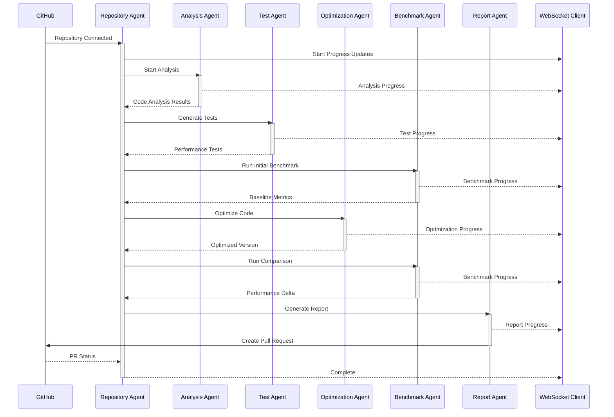

# Autonomous Code Optimization Agent Plan

## Overview

This document outlines the plan for building an autonomous AI agent that analyzes repositories, generates performance tests, optimizes code, and provides optimization reports. The system will leverage LLMs and automated testing to improve code performance while maintaining functionality.

## System Architecture

### 1. Repository Integration Layer
- GitHub App integration for repository access and webhook management
- Repository cloning and management service
- Code change tracking and versioning system

### 2. Analysis Engine
- Static code analysis using AST parsers
- Dynamic code analysis using language-specific profilers
- Integration with Codex CLI for initial codebase understanding
- Metrics collection system for:
  - Time complexity
  - Space complexity
  - Resource usage
  - Function call patterns
  - Hot paths identification

### 3. Test Generation System
- Automated test case generator using LLM
- Performance test scaffolding for different languages
- Load test scenario generation
- Edge case identification and testing
- Test coverage analyzer

### 4. Optimization Engine
- LLM-powered code optimization suggestions
- Pattern-based optimization rules
- Language-specific optimization strategies
- Code transformation pipeline
- Safety validation checks

### 5. Benchmarking System
- Before/after performance comparison
- Resource usage monitoring
- Statistical analysis of improvements
- Regression testing
- Performance regression detection

### 6. Reporting System
- Performance improvement metrics
- Visual performance comparisons
- Code change documentation
- Pull request generation
- Historical optimization tracking

### System Architecture Diagram

```mermaid
graph TB
    subgraph "Cloudflare Edge Network"
        subgraph "Repository Agent"
            GH["GitHub App"]
            RC["Repository Cloner"]
            VCS["Version Control"]
        end

        subgraph "Analysis Agent"
            SA["Static Analysis"]
            DA["Dynamic Analysis"]
            MC["Metrics Collector"]
        end

        subgraph "Test Agent"
            TG["Test Generator"]
            TS["Test Runner"]
            TC["Test Coverage"]
        end

        subgraph "Optimization Agent"
            LLM["Workers AI/OpenAI"]
            RE["Rules Engine"]
            CT["Code Transformer"]
        end

        subgraph "Benchmark Agent"
            BC["Benchmark Runner"]
            RM["Resource Monitor"]
            PM["Performance Metrics"]
        end

        subgraph "Reporting Agent"
            RD["Results Dashboard"]
            PR["PR Generator"]
            VZ["Visualizations"]
        end

        subgraph "Shared Resources"
            DO["Durable Objects"]
            VDB["Vectorize DB"]
            WS["WebSocket Hub"]
        end
    end

    %% External Systems
    GitHub["GitHub"]
    Client["Web Client"]

    %% Data Flow
    GitHub <--> GH
    Client <--> WS

    %% Agent Interactions
    GH --> DO
    RC --> DO
    VCS --> DO

    SA --> DO
    DA --> DO
    MC --> DO

    TG --> DO
    TS --> DO
    TC --> DO

    LLM --> DO
    RE --> DO
    CT --> DO

    BC --> DO
    RM --> DO
    PM --> DO

    RD --> DO
    PR --> DO
    VZ --> DO

    %% Shared Resource Access
    DO <--> VDB
    DO <--> WS
```

### Optimization Process Flow

## Management Interface

### Web Dashboard
- Clean, intuitive interface for:
  - Repository management
  - Budget controls
  - Performance insights
  - Optimization history

### Cost Control Features
- Budget Management:
  - Monthly spending limits
  - Per-repository budgets
  - Cost forecasting
  - Usage alerts
  - Emergency shutoff triggers
  
- Optimization Priority Settings:
  - High: Aggressive optimization (higher cost)
  - Medium: Balanced approach
  - Low: Conservative optimization (lower cost)
  
- Cost Breakdown:
  - LLM token usage
  - Compute resources
  - Storage costs
  - API calls

### Usage Analytics
- Cost per optimization
- Success rate vs. cost
- ROI metrics
- Resource utilization
- Budget utilization trends

## Implementation Phases

### Phase 1: Foundation (Weeks 1-2)
- [ ] Set up GitHub App infrastructure
- [ ] Implement repository cloning and management
- [ ] Create basic code analysis pipeline
- [ ] Integrate Codex CLI for code understanding
- [ ] Establish basic metrics collection
- [ ] Implement cost tracking system
- [ ] Create GitHub Action integration

### Phase 2: Testing Framework (Weeks 3-4)
- [ ] Build test generation system
- [ ] Implement language-specific test runners
- [ ] Create performance test templates
- [ ] Set up test execution environment
- [ ] Develop test result collection system

### Phase 3: Optimization Engine (Weeks 5-6)
- [ ] Implement LLM-based code optimization
- [ ] Create optimization rule engine
- [ ] Build code transformation pipeline
- [ ] Implement safety validators
- [ ] Set up optimization proposal system

### Phase 4: Benchmarking (Weeks 7-8)
- [ ] Create benchmarking infrastructure
- [ ] Implement performance comparison tools
- [ ] Build resource usage monitors
- [ ] Set up regression testing
- [ ] Create benchmark result storage

### Phase 5: Reporting & Integration (Weeks 9-10)
- [ ] Build reporting dashboard
- [ ] Implement PR generation system
- [ ] Create visualization tools
- [ ] Set up notification system
- [ ] Implement optimization history tracking
- [ ] Build cost management interface
- [ ] Implement budget controls

## Technical Stack

### Core Technologies
- Platform: Cloudflare Workers + Cloudflare Agents SDK
- Language: TypeScript/Node.js
- State Management: Cloudflare Durable Objects
- Vector Database: Cloudflare Vectorize
- AI Models: Workers AI + OpenAI API
- UI Framework: Next.js + Tailwind CSS

### Agent System Features
- Built-in state management via Durable Objects
- Real-time WebSocket communication
- Automatic state synchronization
- Task scheduling and workflows
- Long-running operations support
- Built-in retry mechanisms
- Progress tracking
- Event-driven architecture
- Sandboxed workers
- Global edge deployment

### Analysis Tools
- Static Analysis: 
  - Python: ast, pylint
  - JavaScript: ESLint, TypeScript AST
  - Java: JavaParser
- Dynamic Analysis:
  - Python: cProfile, line_profiler
  - JavaScript: Chrome DevTools Protocol
  - Java: JProfiler

### Testing Frameworks
- Python: pytest, locust
- JavaScript: Jest, k6
- Java: JUnit, JMH

## Cloudflare Agent Integration

### Agent Architecture
- Stateful agents using Durable Objects
- Real-time communication via WebSockets
- Automatic state synchronization
- Built-in SQL database per agent
- Global edge deployment

### Agent Types
1. Repository Agent
   - Handles repository cloning and management
   - Manages GitHub webhooks
   - Tracks code changes

2. Analysis Agent
   - Runs code analysis tasks
   - Collects metrics
   - Manages profiling sessions

3. Test Agent
   - Generates and executes tests
   - Manages test environments
   - Collects test results

4. Optimization Agent
   - Runs code optimization tasks
   - Manages LLM interactions
   - Validates code changes

5. Benchmark Agent
   - Runs performance benchmarks
   - Collects metrics
   - Generates comparisons

6. Reporting Agent
   - Generates reports
   - Creates pull requests
   - Manages notifications

### Agent Communication
- WebSocket-based real-time updates
- State synchronization between agents
- Event-driven architecture
- Human-in-the-loop capabilities

### Agent Deployment
- Global edge deployment via Cloudflare
- Automatic scaling
- Built-in monitoring
- Error handling and retries

### Agent State Management
- Per-agent SQL database
- Automatic state synchronization
- Real-time state updates
- Persistent storage

## Security Considerations

### Repository Access
- Implement least privilege access
- Secure credential management
- Repository isolation
- Code execution sandboxing

### LLM Integration
- API key security
- Code data privacy
- Rate limiting
- Token usage monitoring

## Monitoring & Maintenance

### System Health
- Service uptime monitoring
- Error rate tracking
- Processing queue metrics
- Resource usage alerts

### Optimization Quality
- Success rate tracking
- False positive monitoring
- Code quality metrics
- Performance improvement tracking

## Future Enhancements

### Phase 6: Advanced Features
- Multi-repository optimization patterns
- Machine learning-based optimization suggestions
- Custom optimization rules engine
- Advanced visualization and reporting
- Integration with CI/CD pipelines

### Phase 7: Scale & Performance
- Distributed processing
- Caching layer
- Performance optimization
- High availability setup

## Success Metrics

### Performance Metrics
- Average performance improvement percentage
- Resource usage reduction
- Successful optimization rate
- False positive rate
- Cost per optimization
- ROI on optimization efforts

### System Metrics
- Processing time per repository
- System resource usage
- API response times
- Error rates

## Initial Setup Instructions

1. Clone the repository
2. Copy `.env.example` to `.env` and configure:
   - GitHub App credentials
   - OpenAI API key
   - Database credentials
   - Redis configuration
   - Monthly budget limits
   - Cost alert thresholds
3. Run `docker-compose up --build`
4. Install GitHub App in target repositories
5. Configure webhook settings
6. Set up initial monitoring
7. Configure cost controls and alerts

## Development Guidelines

### Code Standards
- PEP 8 for Python code
- ESLint rules for JavaScript
- Google Java Style Guide
- Type hints required
- Documentation required for public APIs

### Testing Requirements
- Unit tests required for all components
- Integration tests for critical paths
- Performance tests for optimization logic
- Security tests for critical components

### Documentation
- API documentation
- Architecture documentation
- Setup guides
- Troubleshooting guides
- Contributing guidelines 