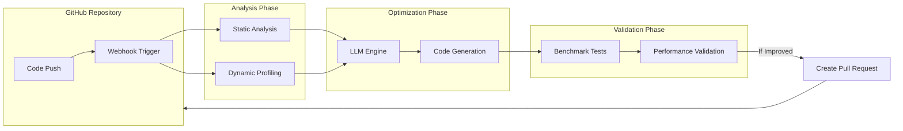

# AutoPerfAI – Code Optimization Without Limits

## Overview

AutoPerfAI supercharges your codebase performance using AI-driven optimization. Deploy as a GitHub App and watch it identify bottlenecks and propose optimized solutions that unlock your code's full potential.

## Project Goals & Objectives

* **Hardware Optimization:** Extract maximum performance from modern CPU architectures, memory hierarchies, and parallel processing. As new CPUs and memory come out, we help you take full advantage of all the features the new CPU and memory have to offer.

* **25x Cost Reduction:** Transform code efficiency into infrastructure savings. Each optimization compounds across your stack, reducing compute costs and improving resource utilization. Better performance means immediate cost savings that scale with your growth.

* **Zero-Effort Optimization:** Fix performance issues automatically during development. No more performance debt or slow code in production. Your users get the fastest possible experience without manual optimization work.

* **Research-Driven Innovation:** Continuously integrate cutting-edge optimization techniques from academic research and industry breakthroughs. Stay ahead with the latest advances in compiler design, parallel processing, and algorithmic improvements.

* **Compound Benefits:** Every optimization multiplies across your entire user base. Small improvements create massive impact at scale - when thousands of users interact with your system, milliseconds become hours of saved time.

## Features

* **AI-Powered Profiling:** Identifies performance bottlenecks with machine learning precision.
* **Automatic Optimization:** Transforms inefficient patterns into high-performance code.
* **Enterprise Validation:** Production-grade testing ensures improvements without regressions.
* **Seamless Integration:** Documents changes with benchmarks and detailed implementation specs.
* **Multi-Language Engine:** Optimizes Python, JavaScript, Java, C++, and TypeScript codebases.
* **Self-Hosted Security:** Deploy within your infrastructure, maintain full control.
* **Evolving AI Capabilities:** Leverages latest LLM advancements for increasingly sophisticated optimizations. As models improve year over year, optimization capabilities automatically expand.
* **Cross-Module Optimization:** Takes advantage of expanded LLM context windows to identify and implement optimizations that span multiple files and components.

## Technical Architecture

### Components

* **GitHub Integration:** Built with Probot for event-driven GitHub interactions (e.g., push events, PR creation).
* **Code Analysis Engine:** Uses static analyzers (AST parsers) and dynamic profilers (e.g., cProfile, Linux perf, JMH) to detect performance issues.
* **LLM Engine:** Leveraging OpenAI's GPT models through LangChain for autonomous code optimization recommendations. Designed to seamlessly integrate new model versions as they're released, unlocking increasingly sophisticated optimization patterns and larger-scope refactoring capabilities.
* **Task Queue & Orchestration:** Redis-based Celery workers running in Docker containers for scalable processing.
* **Benchmarking Service:** Lightweight scripts to benchmark original and optimized code.

### Data Flow

1. **Webhook Trigger:** GitHub pushes trigger analysis jobs via Probot integration.
2. **Performance Analysis:** Static analysis and dynamic profiling identify performance bottlenecks.
3. **Optimization Generation:** LLM generates optimized code proposals.
4. **Benchmark Validation:** Automated benchmarks validate performance improvements.
5. **PR Generation:** Validated optimizations submitted as pull requests to the repository.

