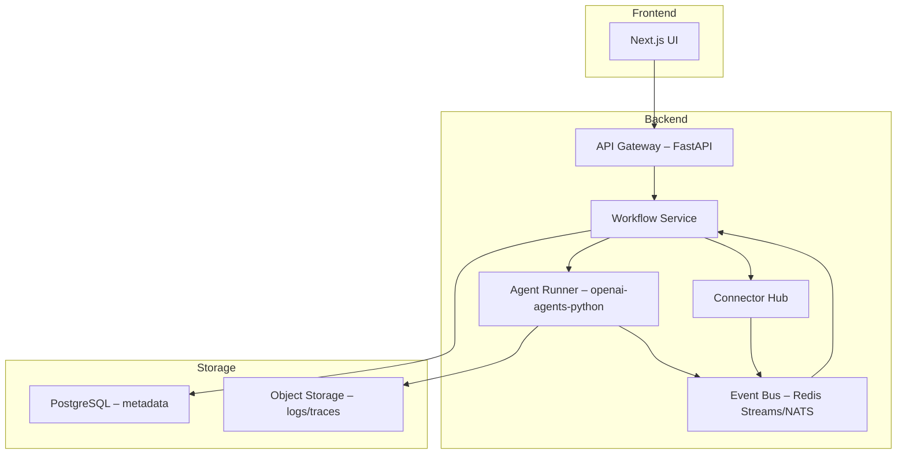
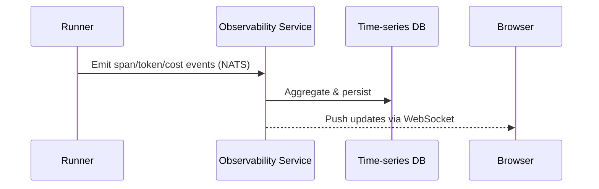

# LLM Agent Orchestrator – Initial Design

## Vision
Build a no-code, self-hostable platform that lets users visually compose, configure, and monitor large-language-model agents and automate tasks across cloud and on-prem services. The experience should feel as approachable as n8n but optimized for AI-centric workflows.

## Core Objectives
1. Zero-code workflow creation and editing.
2. Plug-and-play integration with hundreds of third-party APIs.
3. Declarative agent configuration powered by [openai-agents-python](https://github.com/openai/openai-agents-python).
4. Scalable, event-driven execution engine with realtime tracing.
5. Secure multi-tenant architecture with fine-grained RBAC.

## Personas
| Persona            | Goal                                              |
|--------------------|---------------------------------------------------|
| Product Manager    | Prototype smart workflows without engineering help|
| Data Scientist     | Chain agents for advanced analysis                |
| DevOps Engineer    | Automate operational runbooks                     |
| Business Analyst   | Integrate SaaS tools and generate insights        |

## Feature Matrix
* Drag-and-drop workflow canvas (nodes = agents, tools, triggers, gateways).
* Visual agent composer: instructions, tools, guardrails, handoffs.
* Built-in library of common agents (summarizer, translator, classifier…).
* Connector marketplace (REST, GraphQL, gRPC, Webhooks, DB, message queues).
* Scheduling & event triggers (cron, webhook, queue, file, email, etc.).
* Versioned deployments & rollback.
* Live run console with step-by-step traces.
* Test mode with synthetic inputs and diff output.
* Usage analytics, cost tracking, and alerting.
* Sandbox workspace for safe testing of agents, flows, and integrations without mutating production data.
* Deep observability: real-time metrics (token usage, cost), trace visualization, and LLM-powered trace analysis.

## High-Level Architecture

### Component Details
1. **API Gateway** – AuthN/Z, rate limiting, REST & WebSocket endpoints.
2. **Workflow Service** – Persist workflows, schedule executions, orchestrate jobs via Event Bus.
3. **Agent Runner** – Wraps `Runner.run()` from openai-agents-python, manages retries, timeouts, streaming.
4. **Connector Hub** – Standardized adapter interface; auto-generates UI forms from OpenAPI/JSON-Schema.
5. **Event Bus** – Decouples execution, enables horizontal scaling and at-least-once delivery.
6. **Storage Layer** – PostgreSQL for configs & state, S3-compatible bucket for large artifacts/traces.
7. **Sandbox Environment** – Runs test executions against mocks or shadow resources; enforces read-only mode and cleans up data automatically.
8. **Observability Service** – Aggregates metrics from Agent Runner (token counts, latency, cost), stores traces, and exposes dashboards plus an LLM endpoint to query/interpret traces.

## Data Model Highlights
* **Workflow**: id, name, version, graph (DAG JSON), owner_id, status.
* **Agent**: id, name, instructions, tools[], guardrails[], handoffs[].
* **Execution**: id, workflow_id, run_id, status, started_at, ended_at, cost_estimate.
* **TraceSpan**: id, execution_id, parent_id, type, metadata JSON, duration_ms.
* **TokenUsage**: id, execution_id, prompt_tokens, completion_tokens, total_tokens, cost_usd.
* **SandboxConfig**: id, workflow_id, mock_strategies JSON, data_retention_s policy.

## Extensibility Mechanisms
* **Custom Nodes** – Upload Python package implementing Connector or Tool interface; auto-indexed.
* **Webhook Triggers** – Generate unique endpoint per workflow version.
* **Guardrails SDK** – Validate inputs/outputs with pydantic schemas.

## Security & Compliance
* OAuth2 with optional SSO (OIDC, SAML).
* Secrets management backed by HashiCorp Vault or environment vars.
* All traffic TLS 1.3; signed URLs for file uploads.
* Audit logs and field-level encryption for sensitive data.

## Deployment Strategy
* Docker-compose for quick start.
* Helm chart for Kubernetes (HA mode).
* Separate workers for CPU-bound connectors vs. GPU/LLM-bound agent runs.

## Roadmap (6 Months)
1. MVP: Canvas UI, basic REST connectors, single-agent execution.
2. Multi-agent handoffs + tracing view.
3. Marketplace & one-click install of community connectors.
4. Scaling layer with autoscaling workers.
5. Usage metering & billing integration.

## Realtime Management & Observability Interface

### UX Principles
* **Single-pane visibility** – All critical metrics and traces surface in one dashboard.
* **Live streaming first** – No page refresh needed; data pushes via WebSockets/SSE.
* **Progressive disclosure** – Start with high-level KPIs, drill down to individual agent runs.
* **Actionable context** – From any trace span, jump directly to source node configuration or retry.

### Core Views
1. **Global Dashboard**
   * Active executions, success/error rates, cost spend today.
   * Heatmap of token usage per workflow.
   * Top costly agents and integrations.
2. **Live Trace Explorer**
   * Streaming tree view of an execution (TraceSpan DAG).
   * Inline diff of prompt/completion with token counts.
   * "Analyze with LLM" button → sends trace to Analysis Agent for root-cause insights.
3. **Agent Detail Page**
   * Configuration snapshot with version history.
   * Rolling stats: avg latency, tokens, cost, error types.
   * Sandbox toggle: run test input right from the page.
4. **Cost & Usage Explorer**
   * Timeseries charts of spend vs. budget.
   * Forecast based on last 7/30 days.
   * Alert rule editor (thresholds, anomaly detection).

### Frontend Implementation
* Framework: Next.js + React Query + Chakra UI.
* State sync via WebSocket channel `/ws/metrics` (JSON patches).
* Virtualized lists for large trace trees.

### Backend Streaming Strategy

### APIs
| Method | Path | Description |
|--------|------|-------------|
| GET    | /api/dashboard/summary | Return KPI snapshot |
| GET    | /api/executions/{id}/trace | Paginated trace spans |
| WS     | /ws/metrics | Live metric stream |
| POST   | /api/analysis/run | Trigger LLM trace analysis |

### Technologies
* **NATS JetStream** – high-throughput event transport.
* **Prometheus + TimescaleDB** – raw metrics & long-term storage.
* **Grafana** – optional power-user dashboards via shared data source.

### Edge-case Handling
* Back-pressure: if WebSocket buffer fills, fall back to incremental polling.
* PII redaction: apply regex filters before streaming prompts.
* Multi-tenant isolation: metrics namespaced by org_id.

### Future Enhancements
* Auto-correlation of errors to connector outages.
* LLM-generated weekly performance summaries.
* ClickOps → convert trace path into unit test for CI.

---
This document serves as the foundation for subsequent technical specifications and prototype implementation.
